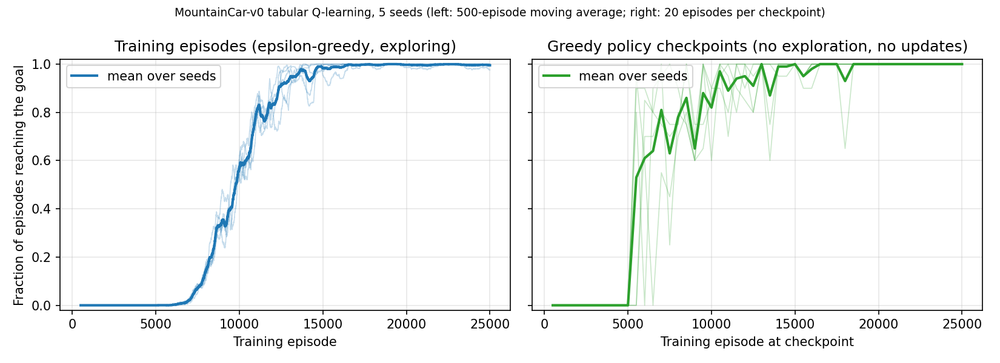

# MountainCar Q-learning

Tabular Q-learning on Gymnasium's MountainCar-v0. The car starts in a valley, the engine is too weak to climb the right-hand hill directly, and each step costs -1 until the flag is reached or the 200-step limit ends the episode. The agent has to learn to rock back and forth to build momentum.

The observation (position and velocity) is continuous, so it is binned into a 40 x 40 grid with one Q-value per action in each cell. This started as a 2021 script, and this version rewrites it so that it can be tested and measured.

## Results

Five agents were trained with identical settings and seeds 0 to 4. Each frozen greedy policy was then run for 200 episodes on environment seeds 10000 to 10199, which were not used for training or for choosing hyperparameters. The Q-table is not updated during evaluation. The random-policy baseline and a hand-coded velocity heuristic use the same 200 environment seeds. The heuristic pushes right when the car's velocity is non-negative and left otherwise, with no learning.

| training seed | goal reached (95% interval) | mean return |
|---|---|---|
| 0 | 100% (98.1 to 100) | -127.8 |
| 1 | 100% (98.1 to 100) | -128.6 |
| 2 | 100% (98.1 to 100) | -135.0 |
| 3 | 96% (92.3 to 98.0) | -120.5 |
| 4 | 100% (98.1 to 100) | -119.1 |
| mean ± std over seeds | 99.2% ± 1.8% | -126.2 ± 6.5 |
| random policy | 0% | -200.0 |
| velocity heuristic | 100% | -119.5 |

The standard deviation is the sample standard deviation over the five training seeds, and the intervals are Wilson intervals over each seed's 200 episodes. A return of -126 means the goal was reached after about 126 steps on average. The learned policies are clearly better than random but slightly slower than the hand-coded heuristic, so the result shows that the agent learns the rocking strategy, not that it finds a faster one.

Seed 3's 8 misses are not stuck episodes. Replaying them without the 200-step limit (`scripts/failure_analysis.py`) shows the policy reaches the goal after 202 to 208 steps, all from start positions between -0.493 and -0.488. Raw numbers, the configuration and the seed lists are in [results/final/results.json](results/final/results.json), and the five Q-tables are alongside it.



The left panel is measured during training, while the agent is still exploring with a decaying epsilon, so it mixes learning progress with the exploration schedule. The right panel is separate: every 500 episodes the current greedy policy is run for 20 episodes on seeds 20000 to 20019 with no exploration and no updates. Greedy checkpoints first reach the goal at episode 5,500 and training success passes 1% at about episode 6,700. From about episode 18,500 every seed reaches the goal on every checkpoint episode. These evaluations share MountainCar's fixed start-state distribution with training, so they show that the policy handles unseen start positions of the same task, not other environments.

## What the code does

- `qlearning.py` holds discretisation, epsilon-greedy selection, the Q-update, training and evaluation as separate functions. Importing it does nothing.
- Bin indices are clipped to the table. Without clipping, an observation exactly at the upper limit would index one past the end.
- Gymnasium's `terminated` and `truncated` flags are handled separately. The 200-step time limit is not a real end of the task, so a truncated step still bootstraps from the next state. A step that reaches the flag uses the observed reward with no future term.
- Exploration is epsilon-greedy with epsilon falling linearly from 1 to 0 over the first half of training.
- Training is headless. `--render-every N` opens a window every N episodes. I checked this with a visible macOS window (SDL cocoa driver, 600 by 400): two render episodes drew 402 frames, and the Q-table is identical to a headless run (covered by a test).
- The two defects of the original script (the bin-width expression and the overwritten exploratory action) can be switched back on, so their effect is measured in [docs/ablation.md](docs/ablation.md). With the original bin-width error the agent reached the goal in 0 of 1,000 evaluation episodes, and the unmodified 2021 script run under legacy Gym (`scripts/run_original_2021.py`) never reached it in 5 seeds of 25,000 training episodes. With only the overwritten action it still learned, because the optimistic Q-table initialisation drives enough exploration.
- Hyperparameters were compared on separate validation seeds before the final run. The table and selection rule are in [docs/tuning.md](docs/tuning.md).
- `tests/` covers bin boundaries and clipping, action selection, the epsilon schedule, terminal versus truncated updates, and that evaluation leaves the table unchanged.

The original script and what was checked in it are described in [docs/notes.md](docs/notes.md). `legacy/original_train.py` keeps it verbatim.

## Setup and reproduction

Tested locally with Python 3.9.6 and 3.12.15 on macOS, with the pinned versions in `requirements.txt`. On both, the test suite passes. Training seed 0 on Python 3.12 gave a Q-table identical to the one saved from the Python 3.9 run. The GitHub Actions workflow in `.github/workflows/tests.yml` runs the tests on Python 3.9 and 3.12 on Linux.

```sh
python3 -m venv .venv
source .venv/bin/activate
pip install -r requirements.txt
python -m pytest
```

Reproduce the reported experiment (about one minute with five CPU cores):

```sh
python experiment.py --config configs/final.json --out results/final
```

Train a single agent and compare it with the random baseline:

```sh
python train.py --seed 0 --out runs/seed0
python train.py --help
```

Training seed 0 from `train.py` with its default arguments produced a Q-table identical to the one saved for seed 0 in the experiment. Re-running the other experiments uses the configs in `configs/`, and results for them are under `results/reference/`:

```sh
python experiment.py --config configs/reference_original_hparams.json --out results/reference/reference_original_hparams --no-plot
```

To rerun the unmodified 2021 script under legacy Gym, use a separate Python 3.9 environment:

```sh
python3 -m venv .venv-legacy
.venv-legacy/bin/pip install -r requirements-legacy.txt
SDL_VIDEODRIVER=dummy .venv-legacy/bin/python scripts/run_original_2021.py --seed 0 --out results/legacy/seed0.json
```

`train.py` evaluates on seeds 50000 and up by default so exploratory runs stay clear of the reported evaluation seeds (10000 to 10199).

## Limits

This is one small, discrete-grid method on one environment, and the final comparison uses five training seeds. Hyperparameter tuning used three seeds and eight settings, so the chosen setting is not shown to be clearly better than the others. The Linux workflow has not run yet because it has not been pushed.

Code and results are released under the MIT licence.
